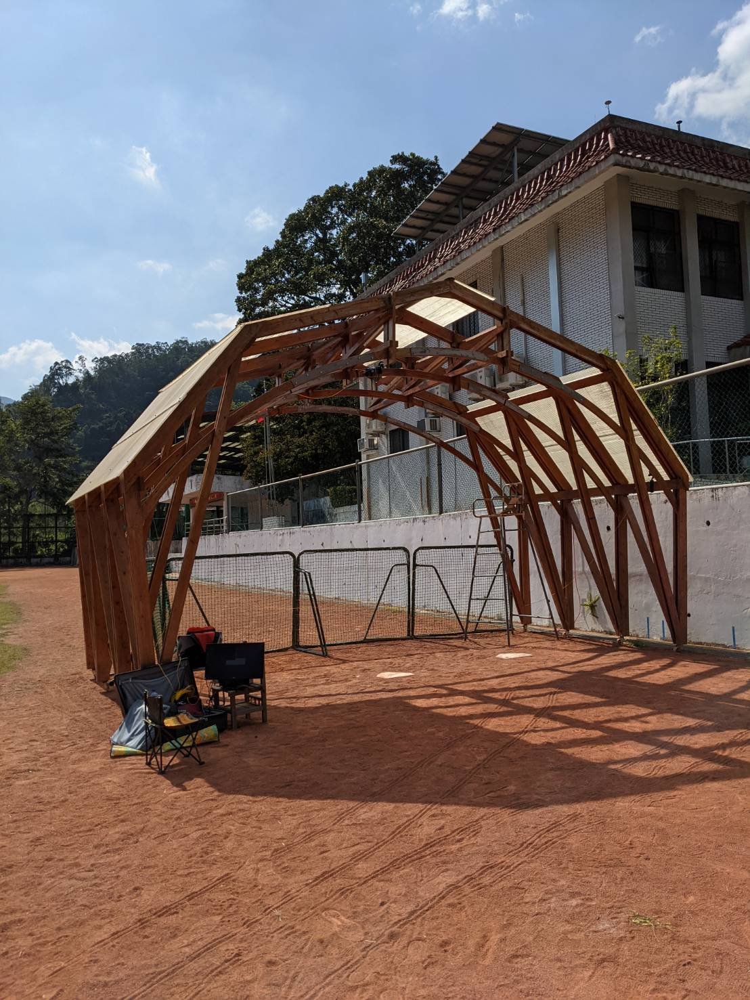
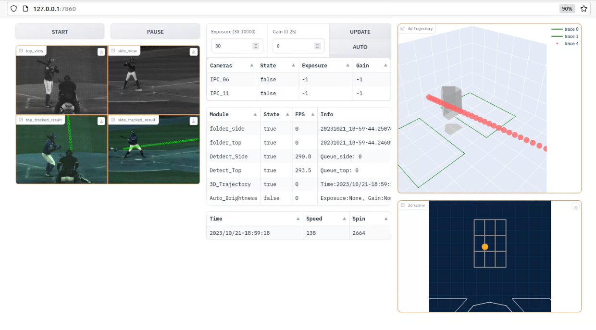
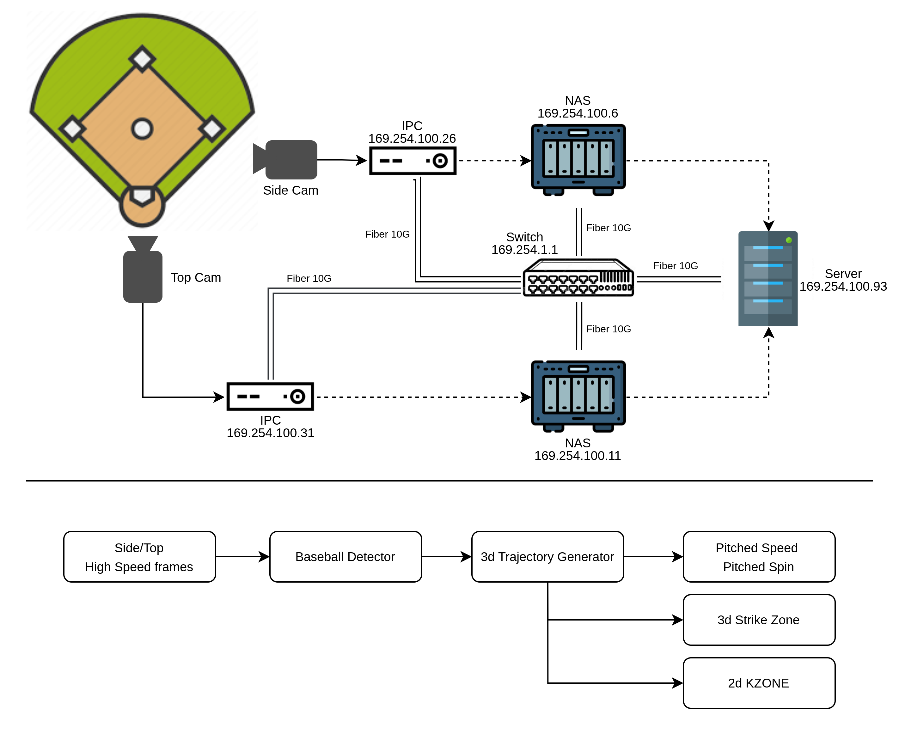

# Strike Zone 3D
Generate real-time 3d baseball trajectory information

## Features
- Show 2D kzone, 3D strike zone, pitched speed, and pitced spin.
- Show real-time result.
- Work on CPBL baseball filed.
- Control the system by webui.

#### Run on Taichung Intercontinental Baseball Stadium (vs. Trackman)

#### Run on outdoor bullpen (Protable Version)

    
    

#### System controller on website user interface 

    
## How it works

## Requirements

- Python 3.8+

